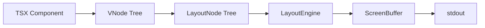

# RFC-019: Terminal Rendering Engine

**Status:** Draft
**Authors:** OpenGem Team
**Created:** 2024-01-01

---


## Summary

This RFC specifies the Terminal Rendering Engine (TRE) - a React-inspired component system for building rich terminal interfaces. It defines:

1. **BaseComponent** class hierarchy with lifecycle hooks
2. **Motion** animation system with declarative props
3. **tw-term** styling system (Tailwind-like classes for terminal)
4. **Layout engine** with flexbox semantics
5. **Event system** for keyboard/mouse input

---

## Motivation

Terminal UIs in OpenGem currently use imperative rendering with direct stdout writes. This approach:

- Lacks component reusability
- Has no state management pattern
- Makes animations difficult to coordinate
- Requires manual ANSI escape code management

A declarative component model enables:

- Familiar React/ShadCN patterns for developers
- Automatic diffing and minimal redraws
- Centralized animation management
- Type-safe styling utilities

---

## Design

### Component Hierarchy

```
BaseComponent<P, S>
├── render(): LayoutNode
├── setState(partial): void
├── componentDidMount(): void
├── componentWillUnmount(): void
└── componentDidUpdate(prevProps, prevState): void
```

### Virtual DOM → Terminal Pipeline



### Motion System

Declarative animations via `motion.*` components:

```tsx
<motion.text
    animate={{ opacity: [0, 1], y: [10, 0] }}
    duration={500}
    easing="easeOut"
>
    Fading in from below
</motion.text>
```

Supported animate properties:
- `opacity`: 0-1 fade
- `x`, `y`: positional offset
- `color`: color transitions
- `frames`: multi-frame sequences

### tw-term Styling

Terminal-native utility classes:

| Category | Classes |
|----------|---------|
| **Text Color** | `text-{color}`, `text-[#hex]` |
| **Background** | `bg-{color}`, `bg-[#hex]` |
| **Typography** | `bold`, `dim`, `italic`, `underline` |
| **Spacing** | `p-{n}`, `px-{n}`, `m-{n}`, `mt-{n}` |
| **Border** | `border`, `border-double`, `border-round` |
| **Flex** | `flex-row`, `flex-col`, `flex-grow` |
| **Size** | `w-full`, `w-{n}`, `h-full`, `h-{n}` |

### Layout Engine

Flexbox-like layout computation:

```tsx
<box className="flex-col p-2 border-double">
    <row className="justify-between">
        <text>Left</text>
        <text>Right</text>
    </row>
    <box className="flex-grow" />
    <text className="text-dim">Footer</text>
</box>
```

---

## Specification

### 1. BaseComponent Interface

```typescript
abstract class BaseComponent<P = {}, S = {}> {
    readonly props: P;
    protected state: S;
    readonly componentId: string;

    abstract render(): LayoutNode | VNode;

    setState(partial: Partial<S>): void;
    forceUpdate(): void;

    // Lifecycle
    componentDidMount?(): void;
    componentWillUnmount?(): void;
    componentDidUpdate?(prevProps: P, prevState: S): void;

    // Hot Reload
    getState?(): HotReloadableState;
    onHotReload?(previousState: HotReloadableState): void;
}
```

### 2. Motion Props

```typescript
interface MotionProps {
    animate?: AnimateSpec | AnimateName;
    duration?: number;     // ms
    delay?: number;        // ms
    easing?: EasingFn;
    repeat?: number | 'infinity';
    repeatType?: 'loop' | 'reverse' | 'mirror';
    onAnimationStart?: () => void;
    onAnimationComplete?: () => void;
}

interface AnimateSpec {
    opacity?: number | number[];
    x?: number | number[];
    y?: number | number[];
    color?: string | string[];
}

type AnimateName = 'typewriter' | 'spinner' | 'frames';
```

### 3. tw-term Parser

```typescript
function parseClassName(className: string): LayoutStyle {
    const style: LayoutStyle = {};

    for (const cls of className.split(/\s+/)) {
        // Text color
        if (cls.startsWith('text-')) {
            const color = cls.slice(5);
            if (color.startsWith('[') && color.endsWith(']')) {
                style.color = color.slice(1, -1); // hex
            } else {
                style.color = resolveNamedColor(color);
            }
        }
        // Background
        else if (cls.startsWith('bg-')) {
            style.bg = resolveColor(cls.slice(3));
        }
        // Padding
        else if (cls.match(/^p[xytblr]?-\d+$/)) {
            Object.assign(style, parseSpacing('padding', cls));
        }
        // Margin
        else if (cls.match(/^m[xytblr]?-\d+$/)) {
            Object.assign(style, parseSpacing('margin', cls));
        }
        // Typography
        else if (TYPOGRAPHY_CLASSES.includes(cls)) {
            style[cls] = true;
        }
        // Border
        else if (cls === 'border') {
            style.border = true;
        }
        else if (cls === 'border-double') {
            style.border = true;
            style.borderStyle = 'double';
        }
    }

    return style;
}
```

### 4. Intrinsic Elements

```typescript
declare global {
    namespace JSX {
        interface IntrinsicElements {
            box: BoxProps;
            row: BoxProps;
            column: BoxProps;
            text: TextProps;
            spacer: SpacerProps;
            divider: DividerProps;
        }
    }
}
```

### 5. LayoutNode Types

```typescript
interface LayoutNode {
    type: 'row' | 'column' | 'box' | 'text' | 'empty';
    children?: LayoutNode[];
    value?: string;
    style?: LayoutStyle;
    key?: string | number;
}

interface LayoutStyle {
    color?: string;
    bg?: string;
    bold?: boolean;
    dim?: boolean;
    italic?: boolean;
    underline?: boolean;
    inverse?: boolean;
    padding?: BoxSpacing;
    margin?: BoxSpacing;
    border?: boolean;
    borderStyle?: 'single' | 'double' | 'round';
    borderColor?: string;
    width?: number | string;
    height?: number | string;
    flexGrow?: number;
    justifyContent?: FlexJustify;
    alignItems?: FlexAlign;
}
```

---

## Implementation Plan

### Phase 1: Core Infrastructure
- [ ] TSX compilation configuration (tsconfig.json)
- [ ] BaseComponent class with lifecycle
- [ ] tw-term parser (`parseClassName`)
- [ ] Integration with existing LayoutEngine

### Phase 2: Motion System
- [ ] motion.* component wrappers
- [ ] AnimationManager integration
- [ ] Keyframe interpolation
- [ ] Typewriter/spinner presets

### Phase 3: Polish
- [ ] Component reconciliation (key-based)
- [ ] Layout diffing
- [ ] Performance profiling
- [ ] Documentation updates

---

## Alternatives Considered

### 1. Ink/React-Blessed

Full React renderers for terminal. Rejected because:
- Heavy dependencies (react, react-reconciler)
- Different mental model from existing codebase
- No direct ANSI control

### 2. Pure Functional Components

No class hierarchy. Rejected because:
- User explicitly requested BaseComponent extension
- Lifecycle hooks harder to model
- Hot reload state more complex

### 3. CSS-in-JS (Emotion/Styled)

Use actual CSS syntax. Rejected because:
- Overkill for terminal properties
- tw-term is simpler and more intuitive
- Better matches existing Tailwind familiarity

---

## Security Considerations

- **Input Sanitization**: Strip ANSI from user-provided text to prevent injection
- **Escape Sequences**: Validate all generated ANSI sequences
- **Memory**: Bound animation counts to prevent denial-of-service

---

## References

- [React Component Model](https://react.dev/reference/react/Component)
- [Framer Motion](https://www.framer.com/motion/)
- [Tailwind CSS](https://tailwindcss.com/)
- [ANSI Escape Codes](https://en.wikipedia.org/wiki/ANSI_escape_code)
